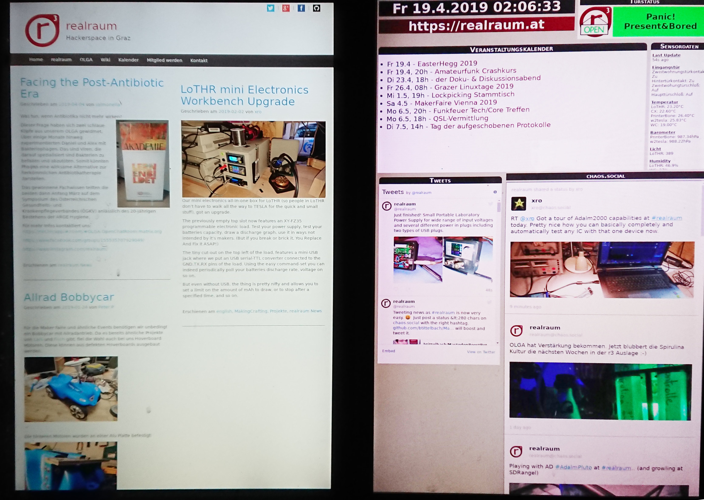
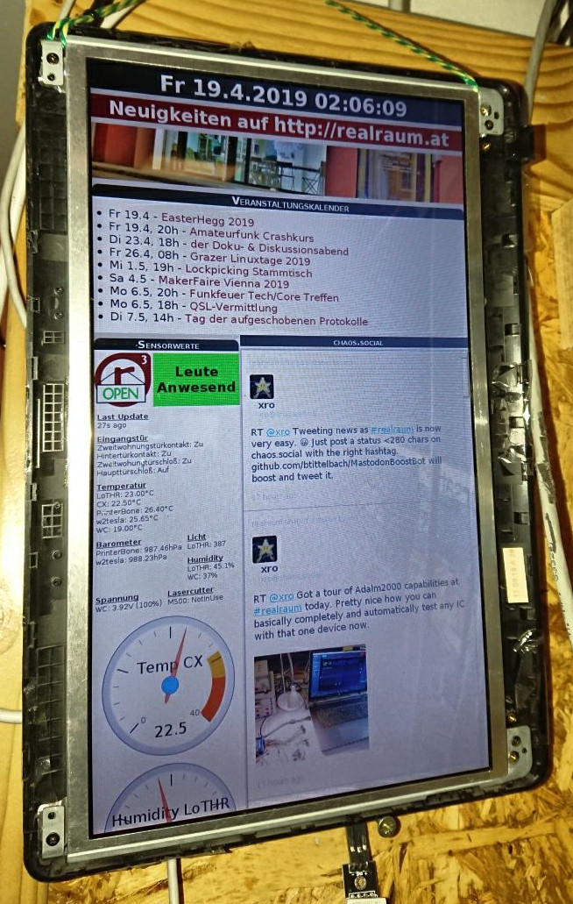

<!-- This set of slides is build with https://yhatt.github.io/marp/ -->
<!--
$theme: default
$size: 16:9
prerender: false
page_number: true
*footer: Presented by Bernhard Tittelbach at EH19
-->

# Bots that Toot and Tweet and Riot

---

# Goal

Enable Hackerspace Members to show
- pictures of ongoing/finished projects
- the kind of stuff being worked on  
  and the onteressts prevalent in space
- Events and Space-News

Display Tidbits on
- Kiosk in and outside Hackerspace
- Website
- Social media
- IRC & Matrix

---
## Kiosk

---
# Use-Case different from existing channels

- Blog: long in-depth articles
- Wiki: Documentation
- Maillinglists: Discussions, Announcements and "offical" Stuff
- Matrix & IRC: day 2 day chat and collaboration

---
# Easiest Way?

- Mastodon chaos.social (with CC to Twitter)
- one news account for everyone to follow

easily post via
  - Matrix (already being used on Desktop and Mobile)
  - Mastadon Webinterface (Browser already open)
  - Mastodon Apps (lot's of choices)
 
---
# Software

- MastodonBoostBot  
  github.com/btittelbach/MastodonBoostbot
  (it's like tootSuite)
- mycete  
  github.com/qbit/mycete

- Javascript & HTML

---
# MastodonBoostBot

- Reblogs status postings
  - of accounts it is following (realraum members)
  - if a certain hashtag is used (#realraum)
- Forwards status postings to twitter

---
# MastodonBoostBot Flow

---

- controlled from an (invite only) matrix room
  - can directly post to Twitter and Mastodon
  - can upload of up to 4 images per status
  - can boost / favourite Toots
  - can retweet / favorite Tweets
  - can deletes toots, tweets, reblogs, etc when when matrix msg is redacted

- subscribes home+stream and optional hashtag-streams
  - filters according to poster, following, sensitivity hashtag, etc
  - notifies a set of matrix rooms with status

---
# Mycete Flow

