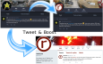

<!-- This set of slides is build with https://yhatt.github.io/marp/ -->
<!--
$theme: default
$size: 16:9
prerender: false
page_number: true
*footer: Presented by Bernhard Tittelbach at GLT19
-->

# Bots that Tweet and Toot and Riot

---
# MastodonBoostBot

## Let users post as Mastodon & Twitter group account

- Reblogs status postings
  - of accounts it is following (e.g. realraum members)
  - if a certain hashtag is used (#realraum || #r3)
- Forwards status postings to twitter

---
# MastodonBoostBot Flow

---

## Matrix-Bot posts on Mastodon & Twitter

- controlled from an (invite only) matrix room
- posts directly to Twitter and Mastodon
- with up to 4 images per status
- boost / favourite Toots
- retweet / favorite Tweets
- delete toots, tweets, reblogs, etc when when matrix msg is redacted

---

## Matrix-Bot to read back Mastodon-Stream

Subscribes
- home-stream
- multiple hashtag-streams

Home-Stream
- will be shown in controlling room.
- including images

Combined Status-Stream can be
- shown in additional configurable Matrix rooms
- filtered for each room according to poster, following, sensitivity hashtag, etc

---
# Mycete Flow

