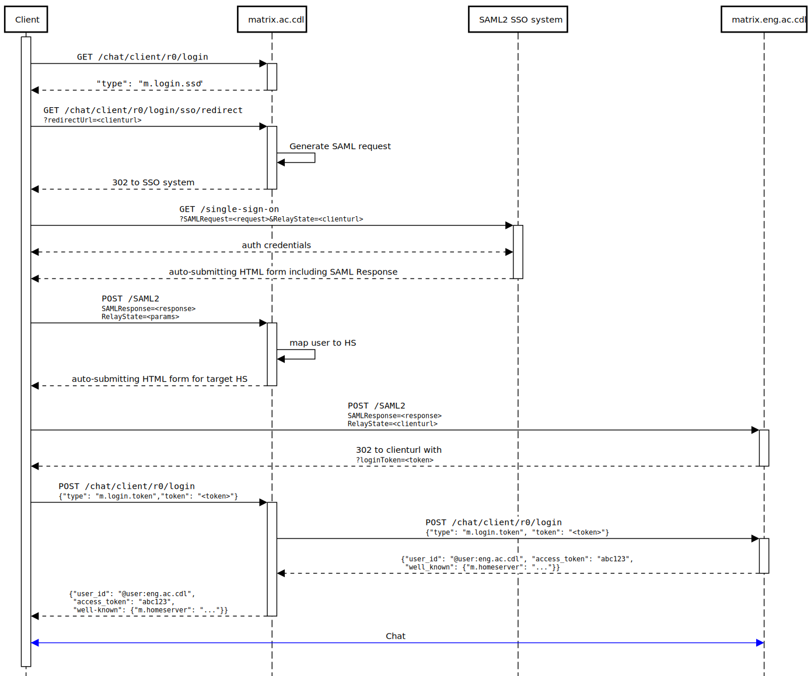

# MSC1730: Mechanism for redirecting to an alternative server during login

## Background/requirements

This is a proposal for a mechanism for handling the following situation.

A large, loosely-coupled organisation wants its members to be able to
communicate with one another via Chat. The organisation consists of several
departments which are cooperative but prefer to host their own infrastructure.

The organisation has an existing single-sign-on system which covers the entire
organisation, and which they would like their members to use when
authenticating to the Chat system.

## Proposal

The response to `POST /chat/client/r0/login` currently includes the fields
`user_id`, `access_token`, `device_id`, and the deprecated `home_server`.

We will add to this the the field `well_known`, which has the same format as
the [`/.well-known/matrix/client`
object](https://chat.api-spec.dingshunyu.top/client_server/r0.4.0.html#get-well-known-matrix-client).

Servers MAY add this field to the login response if they wish to redirect
clients to an alternative homeserver after login. Clients SHOULD use the
provided `well_known` object to reconfigure themselves, optionally validating the
URLs within.

Note: a server that redirects all clients to different servers must nonetheless
consider clients making requests other than `/login`: for example, some clients
may fail to support redirection. It is acceptable in such a case to return a
401 response to all non-`/login` requests if the service does not wish to
support such clients.

## Application

Let's imagine for this description that our organisation is the University of
Canadialand, which is divided into departments including Engineering, History,
Physics, and so on.

Central University IT currently host a SAML2-based single-sign-on system, which
asks users to select their department, and then defers to the departmental
authentication system to authenticate them. Note that the users do not have a
globally-unique identifier.

University IT now sets up a Chat Homeserver instance, which they host at
`https://matrix.ac.cdl`. They run a publicity campaign encouraging university
members to use the service by configuring off-the-shelf Chat clients to use
the homeserver at `https://matrix.ac.cdl`. They may also release customised
clients configured to use that URL by default.

However, the departments actually want to host their own homeservers; these
might be at `https://matrix.eng.ac.cdl`, `https://matrix.hist.ac.cdl`, etc. The
central IT homeserver therefore redirects clients to the departmental
homeserver after login.

A complete login flow is as shown in the following sequence diagram:

Note that this flow is complicated by the out-of-band SAML2 authentication. We
envisage that a similar technique could also be used for a standard
username/password authentication, however.

## Rejected solutions

Alternative solutions might include:

### Have all users on one homeserver

In many situtations, it might be more appropriate to have a single homeserver,
so users' MXids would look like `@user:ac.cdl` instead of
`@user:eng.ac.cdl`.

However, there are circumstances where separate homeservers are required:

* the departments may be only very loosely related
* the departments may have privacy concerns
* the dpeartments may be geographically distributed with slow or unreliable
  links to the central system
* load-balancing may be essential.

### Tell users the C-S API for their home homeserver

We could tell Engineering users to configure their clients with
`https://matrix.eng.ac.cdl`, History users to use `https://matrix.hist.ac.cdl`,
etc.

The problems with this are:

 * Each department must issue its own documentation and publicity advising how
   to configure a Chat client

 * It becomes impractical to distribute preconfigured clients.

### Proxy all C-S endpoints

It would be possible for the the central homeserver to proxy all C-S
interaction, as well as `/login`, directing requests to the right server for
the user.

This is unsatisfactory due to the additional latency imposed, the load on the
central homeserver, and the fact that it makes the central server a single
point of failure for the entire system.

### Require clients to perform a .well-known lookup after login

We could require clients to do a .well-known lookup on the domain of their MXID
once they have discovered it from the `/login` response.

This has the following problems:

* In most cases this `.well-known` lookup will be entirely redundant. It adds
  latency and overhead, and complicates client implementations.

* It complicates deployment, since each department has to host a `.well-known`
  file at their root domain.

### Add an alternative redirection mechanism in the login flow

We could specify that the `/login` response could contain a `redirect` field
property instead of the existing `user_id`/`access_token`/`device_id`
properties. The `redirect` property would give the C-S API of the target
HS. The client would then repeat its `/login` request, and use the specified
endpoint for all future C-S interaction.

This approach would complicate client implementations.

### Modify the single-sign-on flow

It would be possible to modify the single-sign-on flow to allow an alternative
homeserver to be specified for the final `m.login.token`-based call to
`/login` (and subsequent C-S API calls).

This is discussed in more detail in
[MSC1731](https://github.com/matrix-org/matrix-doc/blob/rav/proposals/homeserver_in_sso_login/proposals/1731-redirect-in-sso-login.md).

It has the disadvantage of limiting the solution to SSO logins. The solution
presented in this proposal also extends to password-based logins.

### Use a 3pid login flow

It has been suggested that we could use a login flow based on third-party
identifiers.

In the current ecosystem, to do a 3pid login, clients must still be configured
to send their `/login` request to a particular homeserver, which will then take
them through an authentication process. We are therefore still left with the
problem that we need to switch homeservers between login and initial sync.

An alternative would be for clients to somehow know that they should go through
the single-sign-on process *before* choosing a homeserver, and for the
output of the single-sign-on process to indicate the homeserver to use. This
would require either substantially customised Chat clients, or substantial
modifications to the login flow in Chat, possibly involving authenticating
against an identity server. The latter is something which could be considered,
but the scope of the changes required make it impractical in the short/medium
term.
