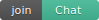

# To

The `To` is a simple url redirection service for the chat
which lets users share links to chat entities without being tied to a
specific app.
Stylistically it serves as a landing page for rooms and communities.

## How can I put a badge on my website linking to my chat room?

You can use the custom badge image, and use it in a link like this:

[](https://to.chat.imzqqq.top/#/#to.chat.imzqqq.top:matrix.org)

You can use this Markdown:

```md
[](https://to.chat.imzqqq.top/#/#to.chat.imzqqq.top:matrix.org)
```

Or this HTML:

```html
<a href="https://to.chat.imzqqq.top/#/#to.chat.imzqqq.top:matrix.org" rel="noopener" target="_blank"></a>
```

to show the badge.

## How does To work?

The `To` preserves user privacy by not sharing any information about the links
being followed with the `To` server - the redirection is calculated
entirely clientside using JavaScript, and the link details is hidden behind a
fragment to avoid web clients leaking it to the server. However, acting as a
landing page it may leak your ip to any number of homeservers involved with the
entity linked to while fetching previews. There is an opt out under which no
previews will be loaded.

Anyone is welcome to host their own version of the `To` app - `To` is
**not** a single point of failure on the chat ecosystem; if the `To`
deployment ever failed, users could trivially copy the room/user/message
details out of the URLs and follow them manually, or change the hostname to
point at an alternative deployment of the service.  The `To` service could
also be hosted in an immutable/signed environment such as IPFS to further
increase its availability and avoid tampering.

## URL Scheme

The `To` URL scheme is

| Entity type: | Example URL                                                       |
|--------------|-------------------------------------------------------------------|
| Rooms:       | https://to.chat.imzqqq.top/#/#matrix:matrix.org                            |
| Rooms by ID: | https://to.chat.imzqqq.top/#/!cURbafjkfsMDVwdRDQ:matrix.org                |
| Users:       | https://to.chat.imzqqq.top/#/@matthew:matrix.org                           |
| Messages:    | https://to.chat.imzqqq.top/#/#matrix:matrix.org/$1448831580433WbpiJ:jki.re |

The #/ component is mandatory and exists to avoid leaking the target URL to the
server hosting `To`.

Note that linking to rooms by ID should only be used for rooms to which the
target user has been invited: these links cannot be assumed to work for all
visitors.

(Technically the # and @ in the URL fragment should probably be escaped, but in
practice for legibility we bend the rules and include it verbatim)

## Build Instructions

1. Install [yarn](https://classic.yarnpkg.com/en/docs/install)
2. `yarn`
3. `yarn start`
4. Go to <http://localhost:5000> in your browser
