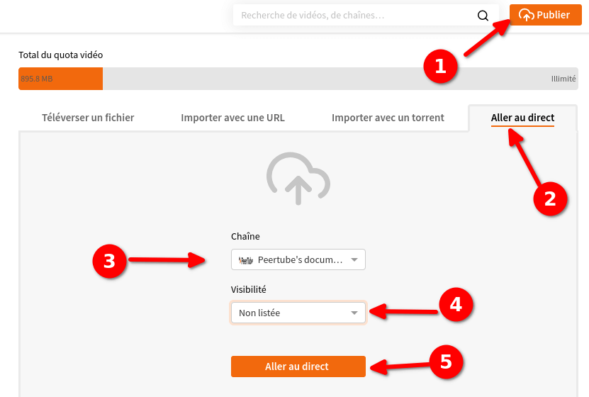
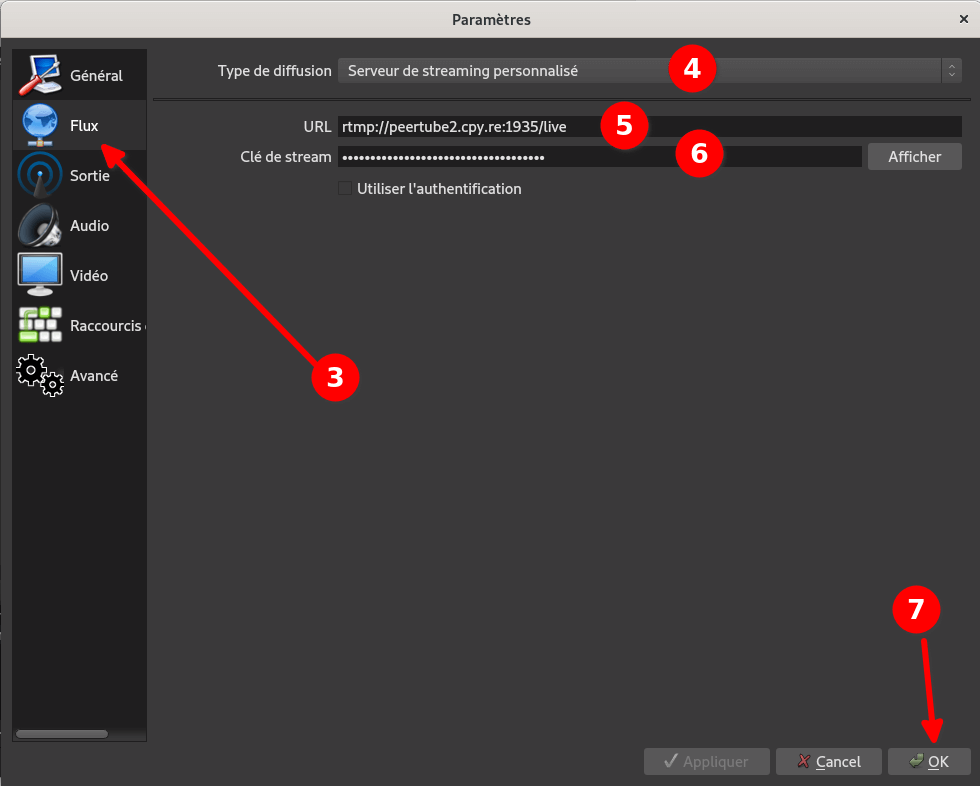
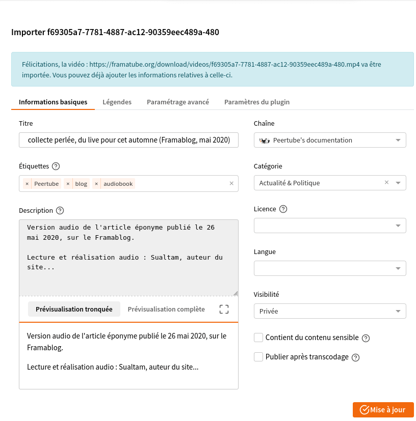

# Publier une vidéo ou un direct

## Téléverser une vidéo

Pour publier une vidéo, vous devez cliquer sur le bouton <i data-feather="upload-cloud"></i>**Publier** en haut à droite de la page. Une fois cliqué vous avez 3 façons de téléverser un fichier&nbsp;:

  1. en sélectionnant un fichier sur votre appareil
  1. en important une vidéo en ligne avec son URL
  1. en important un vidéo en ligne avec son URI (torrent)

### Téléverser un fichier

Une fois que vous avez cliqué sur le bouton <i data-feather="upload-cloud"></i>**Publier** en haut à droite de la page, vous arrivez par défaut sur l'onglet **Téléverser un fichier**. Vous devez alors sélectionner&nbsp;:

  1. la **chaîne** dans laquelle vous souhaitez ranger le fichier (peut être fait/changé après le téléversement)
  1. la **visibilité** du fichier (peut être fait/changé après le téléversement)
  1. sélectionner un fichier sur votre appareil dans un des formats acceptés en cliquant sur **Sélectionner le fichier**

Durant le téléversement vous pouvez ajouter [quelques détails à votre fichier](/fr/use-create-upload-video?id=détails-du-fichier)

### Importer avec une URL

Si l'admin de votre instance a activé cette option, vous pouvez importer n'importe quelle URL [supportées par youtube-dl](https://ytdl-org.github.io/youtube-dl/supportedsites.html) ou une URL qui pointe directement vers un fichier MP4. Pour faire cela vous devez&nbsp;:

  1. cliquer sur le bouton <i data-feather="upload-cloud"></i>**Publier** en haut à droite de la page
  1. cliquer sur l'onglet **Importer avec une URL**
  1. coller l'URL du fichier dans le champ **URL**
  1. sélectionner la **chaîne** dans laquelle vous souhaitez ranger le fichier (peut être fait/changé après le téléversement)
  1. sélectionner la **visibilité** du fichier (peut être fait/changé après le téléversement)
  1. cliquer sur le bouton **Importer**.

!> Vous devez vous assurer d'avoir les droits sur le contenu, sinon vous risquez des problèmes légaux pour vous et votre instance.

Durant le téléversement vous pouvez ajouter [quelques détails à votre fichier](/fr/use-create-upload-video?id=détails-du-fichier)

### Importer avec un torrent

Si l'admin de votre instance a activé cette option, vous pouvez importer n'importe quel torrent qui pointe directement sur un fichier MP4. Pour faire cela vous devez&nbsp;:

  1. cliquer sur le bouton <i data-feather="upload-cloud"></i>**Publier** en haut à droite de la page
  1. cliquer sur l'onglet **Importer avec un torrent**
  1. sélectionner un fichier `.torrent` sur votre ordinateur ou coller l'URL magnet d'un fichier
  1. sélectionner la **chaîne** dans laquelle vous souhaitez ranger le fichier (peut être fait/changé après le téléversement)
  1. sélectionner la **visibilité** du fichier (peut être fait/changé après le téléversement)
  1. cliquer sur le bouton **Importer**.

!> Vous devez vous assurer d'avoir les droits sur le contenu, sinon vous risquez des problèmes légaux pour vous et votre instance.

Durant le téléversement vous pouvez ajouter [quelques détails à votre fichier](/fr/use-create-upload-video?id=détails-du-fichier).

## Diffuser un direct (dans Tube >= v3)

Si l'admin de l'instance a activé cette option, vous pouvez créer un direct en utilisant Tube et un logiciel de diffusion en temps réel (par exemple [OBS](https://obsproject.com/)). Pour faire cela, vous devez&nbsp;:

  1. cliquer sur le bouton <i data-feather="upload-cloud"></i>**Publier** en haut à droite de la page
  1. cliquer sur l’onglet **Aller au direct**
  1. sélectionner la chaîne sur laquelle vous souhaitez diffuser le direct
  1. sélectionner la visibilité de ce direct
  1. cliquer sur le bouton **Aller au direct**.

Dans l’onglet **Paramètres du direct** vous pouvez&nbsp;:

  * voir **l’URL RTMP du direct** à entrer dans votre logiciel de diffusion
  * voir la **Clé de diffusion du direct** associée au direct et à mettre aussi dans votre logiciel de diffusion. **C’est une clé privée permettant n'importe qui en sa possession de diffuser une vidéo sur le direct&nbsp;: elle ne doit pas être partagée&nbsp;!**
  * choisir de **publier une rediffusion automatiquement à la fin du direct** si l'admin de votre instance l'a autorisé&nbsp;: à la fin du direct, Tube créera une rediffusion à la même URL que le direct
  * activer **C'est un direct permanent** pour envoyer des flux plusieurs fois dans un direct permanent. L'URL pour vos spectateurs ne changera pas, mais vous ne pouvez pas sauvegarder des rediffusions de vos directs. L'URL ne changera pas entre deux événement et une déconnexion du flux ne stoppera pas le direct.

Vous êtes désormais prêt⋅e pour diffuser en direct&nbsp;! Dans cet exemple nous utiliserons [le logiciel OBS](https://obsproject.com/) pour envoyer le flux vers Tube mais vous pouvez utiliser n'importe quel logiciel qui utilise [le protocole RTMP](https://fr.wikipedia.org/wiki/Real_Time_Messaging_Protocol).

  1. ouvrez OBS sur votre ordinateur
  1. cliquez sur **Paramètres** (ou sur **Fichier** dans la barre supérieure puis sur **Paramètres**)
  1. cliquez sur **Flux** dans le menu latéral gauche
  1. choisissez **Serveur de streaming personnalisé** dans le type de diffusion
  1. entrez l'**Url RTMP du direct** de Tube dans le champ **URL**
  1. entrez la **Clé de diffusion du direct** de Tube dans le champ **Clé de stream**
  1. ne cochez **pas** la case **Utiliser l'authentication** et cliquez sur le bouton **OK**
  1. une fois prêt⋅e, cliquez sur le bouton **Commencer le streaming** pour diffuser sur votre instance Tube&nbsp;: il y aura un petit délai entre votre écran et la diffusion.

## Détails du fichier

### Informations basiques

  * **Titre** : le titre de la vidéo (quelque chose de plus attractif que `mavideo.mp4` par exemple :wink:)
  * **Étiquettes** : Les étiquettes peuvent être utilisées pour suggérer des recommandations pertinentes. Il y a un maximum de cinq étiquettes. Appuyez sur Entrée pour ajouter une nouvelle étiquette.
  * **Description** : le texte que vous souhaitez faire apparaître sous la vidéo.Les descriptions vidéo sont tronquées par défaut et nécessitent une action manuelle pour les développer. Vous pouvez voir le rendu sous la zone d'édition. Supporte la syntaxe markdown.
  * **Chaîne** : la chaîne dans laquelle vous souhaitez ranger la vidéo
  * **Catégorie** : quelle est la catégorie de la vidéo (Actualité et politique ? Art ? Musique ? etc…)
  * **Licence** :
    * Attribution
    * Attractif - Partage dans les mêmes conditions
    * Attribution - Pas d’œuvre dérivée
    * Attribution - Utilisation non commerciale
    * Attribution - Utilisation non commerciale - Partage dans les mêmes conditions
    * Attribution - Utilisation non commerciale - Pas d’œuvre dérivée
    * Domaine public
  * **Langue** : quelle est la langue principale de la vidéo
  * **Visibilité** : privée, non listée, publique ou interne ([voir ce que cela signifie](/fr/use-create-upload-video?id=options-de-visibilité-des-vidéos))
  * **Contient du contenu sensible** : certaines instances ne listent pas, par défaut, les vidéos sensibles ou avec du contenu pour adultes.

### Légendes

Cet onglet vous permet d'ajouter des sous-titres à votre vidéo. Pour en ajouter, vous devez&nbsp;:

  1. aller dans l'onglet **Légendes**
  1. cliquer sur le bouton <i data-feather="plus-circle"></i> **Ajouter un nouveau sous-titre**
  1. sélectionner une langue dans la liste
  1. cliquer sur **Choisir le fichier de sous-titre**
  1. sélectionner un fichier `.vtt` ou `.srt` sur votre ordinateur
  1. cliquer sur le bouton **Ajouter ce sous-titre**
  1. cliquer sur le bouton **<i data-feather="check-circle"></i> Mise à jour**

### Paramétrage avancé

Cet onglet vous permet&nbsp;:

  * de modifier l'image de prévisualisation de votre vidéo
  * d'ajouter un court texte pour dire aux gens comment ils peuvent vous soutenir (plateforme d'adhésion...) - supporte la syntaxe markdown
  * d'activer/désactiver les commentaires sur la vidéo
  * d'activer/désactiver le téléchargement de la vidéo

?> Pensez à cliquer sur le bouton **<i data-feather="check-circle"></i> Mise à jour** après vos modifications

### Options de visibilité des vidéos

  * **Public** : votre vidéo est publique. Tout le monde peut la voir (en utilisant un moteur de recherche, un lien ou un embed) ;
  * **Interne** : seul un utilisateur authentifié ayant un compte sur votre instance peut voir votre vidéo. Les utilisateurs effectuant une recherche à partir d'une autre instance ou ayant le lien sans être authentifiés ne peuvent pas la voir ;
  * **Non listé** : seules les personnes ayant un lien privé peuvent voir cette vidéo ; la vidéo n'est pas visible sans son lien (ne peut être trouvée par une recherche) ;
  * **Privé** : seul vous pouvez voir la vidéo.
