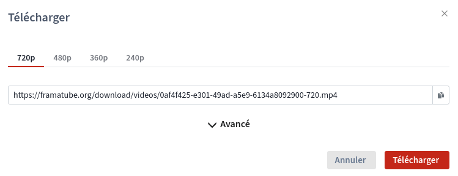

# Télécharger une vidéo

Vous pouvez télécharger des vidéos directement depuis l'interface web de Tube. Pour ce faire vous devez cliquer sur le bouton  en cliquant sur le bouton <i data-feather="download"></i> **Télécharger** sous la vidéo&nbsp;:

Un encart apparaîtra avec les options par défaut&nbsp;: téléchargement direct de la vidéo dans la meilleure qualité. Il vous suffit alors de cliquer sur le bouton **Télécharger** pour récupérer la vidéo sur votre ordinateur.

En cliquant sur <i data-feather="chevron-down"></i> **Avancé**, vous obtiendrez des informations détaillées sur la vidéo, concernant son format et ses flux vidéo et audio&nbsp;:

Vous avez aussi la possibilité de télécharger la vidéo en *torrent*.

?> **Téléchargement direct**&nbsp;: votre navigateur web télécharge la vidéo depuis le serveur d'origine de la vidéo  
**Torrent (fichier .torrent)**&nbsp;: vous avez besoin d'un client compatible WebTorrent pour télécharger la vidéo non seulement depuis le serveur d'origine mais aussi depuis d'autres pairs qui téléchargent la vidéo

**Astuce** : selon l'instance, vous pouvez télécharger la vidéo dans différents formats. Toutefois, veuillez-vous assurer d'avoir obtenu au préalable une licence compatible avec l'utilisation prévue de la vidéo.
