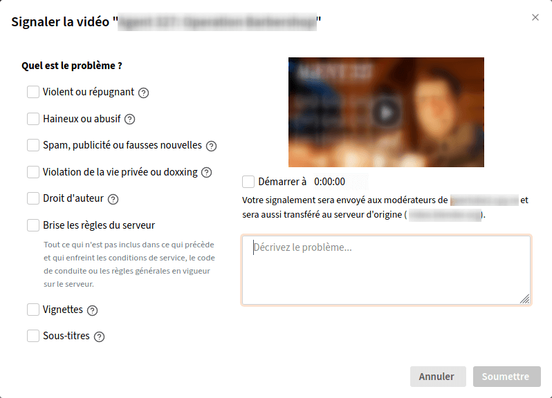

# Signaler un contenu

## Depuis son compte Tube

Pour signaler un contenu en étant connecté à votre compte d'une instance Tube, vous devez, sur la page du contenu&nbsp;:

  1. cliquer sur <i data-feather="more-horizontal"></i>
  1. cliquer sur <i data-feather="flag"></i> **Signaler**
  1. indiquer ce qui pose problème&nbsp;:
    * **Violent ou répugnant**
    * **Haineux ou abusif**
    * **Spam, publicité ou fausses nouvelles**
    * **Violation de la vie privée ou doxxing**
    * **Droit d'auteur**
    * **Brise les règles du serveur**
    * **Vignettes** (le problème se trouve dans la vignette)
    * **Sous-titres** (le problème se trouve dans les sous-titres)
  1. [Optionnel] si besoin, indiquer l'horodatage du problème
  1. décrire le problème (ce qui peut vous paraître évident ne l'est pas forcément pour la personne qui reçoit le signalement)

?> Si la vidéo est hébergée sur une autre instance que celle sur laquelle vous avez votre compte, le signalement sera **aussi** envoyé à la modération de celle-ci.

## En tant que visiteur ou visiteuse

Pour signaler un contenu en n'étant pas connecté à un compte, vous devez&nbsp;:

  1. cliquer sur **À propos** dans le menu latéral gauche de l’instance en question
  1. cliquer sur le bouton **Contact de l’administrateur**
  1. remplir les champs nécessaire, décrire le problème et indiquer l'URL du contenu ainsi que la raison du signalement
