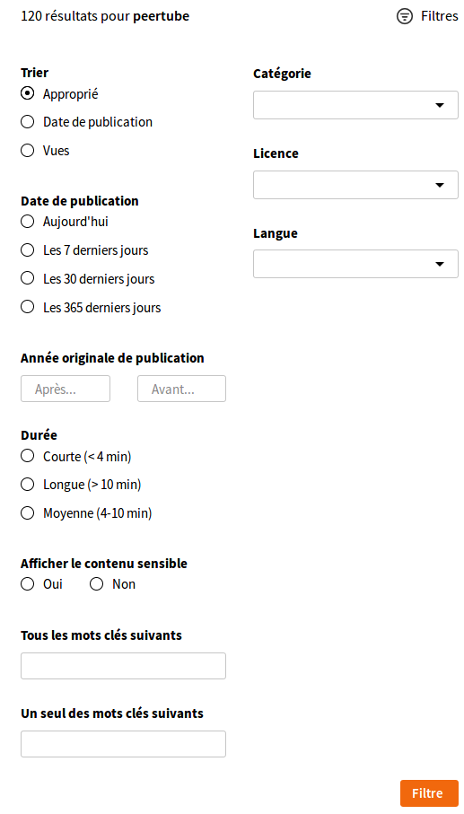

# Recherche de vidéos

La recherche vidéo vous aide à trouver des vidéos à l'intérieur et à l'extérieur de votre instance. Les vidéos des autres instances fédérées par votre instance (c'est-à-dire les instances suivies par votre instance, un paramètre que votre administrateur d'instance fait manuellement) peuvent être trouvées via les mots-clés et autres critères de la recherche avancée :

**Astuce :** Vous pouvez également trouver les comptes et vidéos non encore fédérés par votre instance en collant leur URL directement dans la barre de recherche de votre instance.
