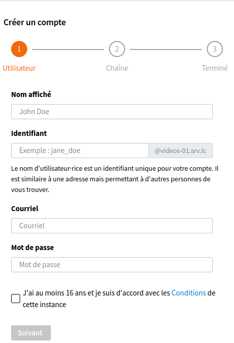
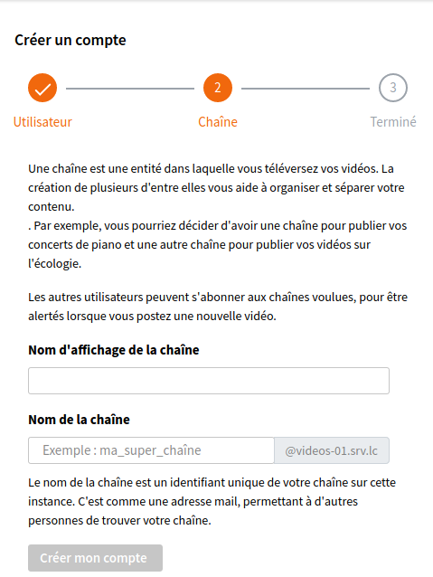
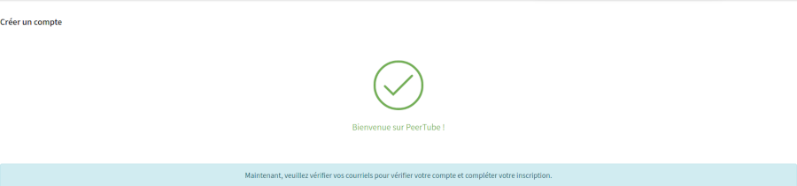
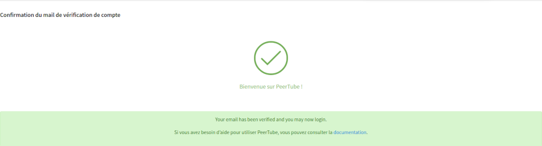
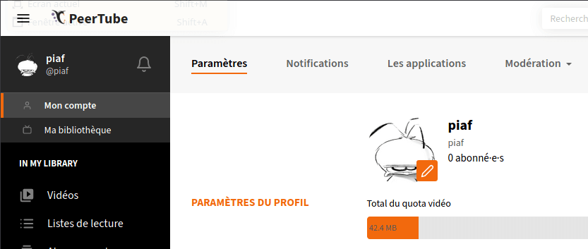

# Paramétrer son compte

## Créer un compte Tube

Pour pouvoir téléverser une vidéo, vous devez avoir un compte sur un _instance_ (un serveur sur lequel est installé le logiciel Tube). Le projet Tube tient à jour une liste de
instances publiques sur ce site : [instances.joinpeertube.org](https://instances.joinpeertube.org/instances) (notez que les administrateurs d'instance doivent s'ajouter eux-mêmes à cette liste manuellement, elle n'est pas générée automatiquement).

Une fois que vous avez trouvé une instance qui vous convient, cliquez sur le bouton "Créer un compte" et indiquez votre **nom à afficher**,  votre **nom d'utilisateur** (identifiant), une **adresse courriel** et un **mot de passe** :

Après avoir complété la première étape, vous passez à la seconde après avoir cliquer sur le bouton "Suivant", indiquez le **nom d'affichage de votre chaîne** et le **nom de votre chaîne** (identifiant de votre chaîne) :

Après avoir complété la deuxième étape, une confirmation de création de compte s'affiche après avoir cliquer sur le bouton "Créer un compte" :

Après avoir cliquez sur le lien pour vérifier votre compte et compléter votre inscription :

## Se connecter à votre instance Tube

Pour vous connecter, vous devez vous rendre à l'adresse de l'instance particulière à laquelle vous vous êtes inscrit. Les instances partagent les vidéos des autres, mais
l'index des comptes de chaque instance n'est pas fédéré. Cliquez sur le bouton "Se connecter" dans le coin en haut à gauche, puis indiquez votre identifiant ou adresse courriel et mot de passe. Notez que le nom d'utilisateur et le mot de passe sont **sensibles à la casse** (Tube fait la distinction entre un 'a' et 'A') !

Une fois connecté, votre identifiant et votre nom affiché apparaîtront sous le nom de l'instance.

## Mettre à jour son profil

Pour mettre à jour votre profil d'utilisateur, changer votre avatar, changer votre mot de passe, etc… Cliquez sur <i data-feather="user"></i> **Mon compte** sous votre nom de profil dans la barre latérale. Vous avez alors quelques options :

*  Paramètres
*  Notifications
*  Les applications
*  Modération
  * Comptes ignorés
  * Serveurs ignorés
  * Rapport des abus

### Mes paramètres

La section des paramètres est découpée en plusieurs parties :

#### PARAMÈTRES DU PROFIL

Dans cette partie vous pouvez :

* changer votre avatar en envoyant, depuis votre ordinateur, une image au format .png, .jpeg ou .jpg avec une taille maxi de 100 Ko (taille pouvant varier en fonction des instances).
* voir votre quota d'upload utilisé / maximal. Ce quota est déterminé par l'instance hébergeant votre compte, et peut varier de quelques Mo à des milliers de Go,
ou même être illimité. Sur les instances qui créent des versions de qualité différente de vos vidéos après les avoir téléchargées (après une étape de transcodage vidéo),
l'espace disque occupé par toutes les versions de la vidéo est pris en compte, et pas seulement celui que vous avez téléchargé.
* modifier votre nom d'affichage, qui est différent de votre nom d'utilisateur. Votre nom d'utilisateur ne peut pas être modifié une fois créé.
* ajouter une description de l'utilisateur, qui sera affichée sur votre profil public. C'est souvent la première chose vue par les visiteurs et les utilisateurs de Tube, et représente votre identité, alors ne la négligez pas !

#### PARAMÈTRES DES VIDÉOS

* Sur certaines instances, vous pouvez choisir comment afficher des vidéos au contenu sensible : avec flou, sans flou ou 'ne pas lister'.
* Afficher uniquement les vidéos dans les langues / sous-titres suivants dans les pages **Récemment ajoutées**, **Tendances**, **Locales**, **Les plus appréciées** et **Recherche**.
* Aider au partage de vidéos en utilisant le P2P.
* Démarrer immédiatement la lecture d'une vidéo en arrivant sur sa page.
* Lire automatiquement la vidéo suivante.

#### NOTIFICATIONS

Vous pouvez paramétrer quelles notifications vous souhaitez recevoir par mail et/ou via l'interface de l'instance.

#### INTERFACE

Vous pouvez modifier l'apparence de votre instance avec un thème préinstallé.

#### MOT DE PASSE

Pour changer votre mot de passe, vous devez le taper deux fois et cliquer sur **_Changer le mot de passe_**.

#### COURRIEL

Pour changer l'adresse mail associée à votre compte ; vous devrez entrer votre mot de passe actuel pour valider le changement.

#### ZONE DE DANGER

Pour supprimer votre compte.

!> **Une fois votre compte supprimé, aucun retour en arrière n'est possible. Il vous sera demandé de confirmer cette action.**
