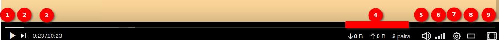
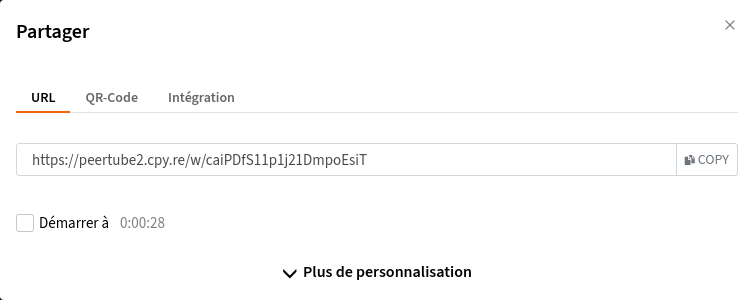
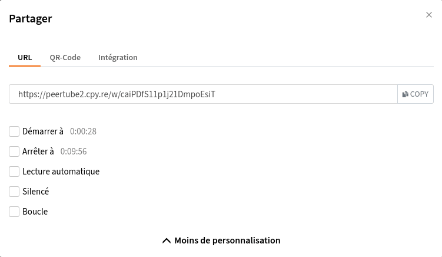
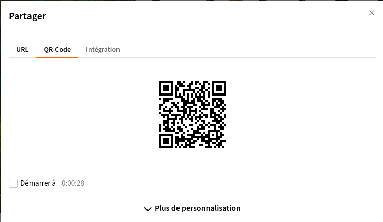
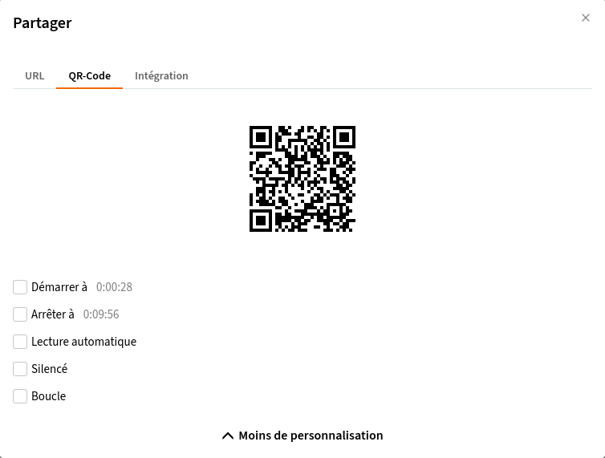
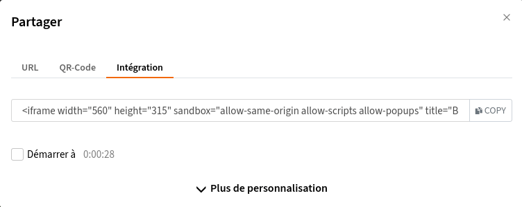
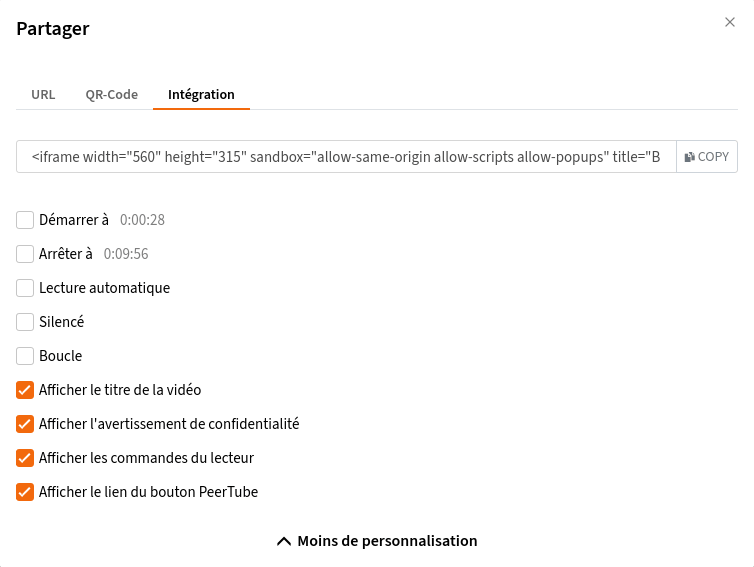

# Visionner, partager et télécharger une vidéo

## Visionner une vidéo

Le lecteur vidéo se compose de&nbsp;:

  1. <i data-feather="play"></i> et <i data-feather="pause"></i> un bouton pour lire ou mettre en pause la vidéo
  1. <i data-feather="skip-forward"></i> un bouton pour passer à la vidéo suivante
  1. un indicateur de temps (passé/total)
  1. statistiques P2P (si activé ; sinon vous verrez **HTTP** à la place)
  1. <i data-feather="volume-2"></i> ou <i data-feather="volume-x"></i> pour couper ou réactiver le son de la vidéo
  1. contrôleur de volume : vous pouvez utiliser les flèches de votre clavier pour augmenter/diminuer le volume (après avoir préalablement cliqué sur l'icône)
  1. <i data-feather="settings"></i> un bouton pour les paramètres : changer la qualité, la vitesse, (des)activer les sous-titres, etc…
  1. mode cinéma pour élargir l'affichage
  1. mode plein écran

## Partager une vidéo

Pour partager une vidéo, vous devez d'abord aller sur la page vidéo que vous voulez partager. Si vous êtes l'éditeur, vous pouvez lister toutes vos vidéos via l'option _Mes Vidéos_ du menu de gauche. Une fois sur la page vidéo, il vous suffit de cliquer sur le bouton <i data-feather="share-2"></i> **PARTAGER**&nbsp;:

?> les petites icônes en fin de ligne vous permettent de copier l'URL entière en une seule fois.

## URL

L'adresse de la vidéo, par exemple&nbsp;: `https://framatube.org/videos/watch/9c9de5e8-0a1e-484a-b099-e80766180a6d`. Cette adresse peut être envoyée à votre contact comme vous le souhaitez, il pourra accéder directement à la vidéo.

## QR code

Il est possible de partager un vidéo grâce à un QR code&nbsp;:

## Intégration

Un code d'intégration qui vous permet d'insérer un lecteur vidéo dans votre site Web.
Lorsqu'un utilisateur partage un lien Tube, l'application expose des informations en utilisant le format OEmbed permettant aux sites Web externes d'intégrer automatiquement la vidéo (c'est-à-dire d'injecter le lecteur Tube). Certaines plateformes le font avec n'importe quel lien externe (Twitter, Mastodon…) mais d'autres plateformes peuvent nécessiter une configuration supplémentaire.

## Plus de personnalisation

Pour chaque option, vous pouvez :

  * définir une heure de début en cliquant sur **Début à** et modifier l'horodatage
  * s'il y a des sous-titres, choisir d'en afficher un par défaut en cliquant sur **Sélection automatique des sous-titres**.

Vous avez également la possibilité de personnaliser un peu plus en cliquant sur le bouton **Plus de personnalisation** :

  * **Démarrer à** : choisissez l'heure à laquelle vous souhaitez démarrer la vidéo ;
  * **Arrêter at** : choisissez l'heure à laquelle vous voulez arrêter la vidéo ;
  * **Lecture automatique** : cliquez sur ce bouton si vous souhaitez que la vidéo démarre automatiquement ;
  * **Silencé** : cliquez sur ce bouton si vous souhaitez que la vidéo soit lue sans son (l'utilisateur peut annuler ce réglage pendant la lecture) ;
  * **Boucle** : cliquez si vous voulez que la vidéo soit répétée ;
  * **Afficher le titre de la vidéo** (uniquement pour **Intégration**) : décochez si vous ne voulez pas afficher le titre de la vidéo ;
  * **Afficher l'avertissement de confidentialité** (uniquement pour **Intégration**) : décochez si vous ne voulez pas afficher le message d'avertissement "Regarder cette vidéo peut révéler votre adresse IP à d'autres personnes" ;
  * **Afficher les commandes du lecteur** (uniquement pour **Intégration**) : décochez si vous ne voulez pas afficher les boutons lecture/pause, etc.
  * **Afficher le lien du bouton Tube** (uniquement pour **Intégration**) : permet d'afficher un lien **PEERTUBE** sur le lecteur pour visionner la vidéo sur l'instance l'hébergeant.

## Raccourcis clavier

Vous pouvez utiliser des raccourcis pour effectuer quelques actions. pour faire apparaître la liste des ces raccourcis vous pouvez soit cliquer sur votre avatar puis sur **<i data-feather="command"></i>Raccourcis clavier** (soit sur **Raccourcis clavier** directement en bas du menu latéral gauche si vous n'êtes pas connecté⋅e).
Vous pouvez aussi utiliser `?`.

  * `?`	Montrer / cacher ce menu d'aide
  * `esc`	Cacher ce menu d'aide
  * `/s`	Focus sur la barre de recherche
  * `b`	(Dés)activer le menu de gauche
  * `g o`	Découvrir des vidéos
  * `g t`	Aller sur la page des tendances
  * `g r`	Aller sur la page des vidéos récemment ajoutées
  * `g l`	Aller sur la page des vidéos locales
  * `g u`	Aller sur la page de téléversement de vidéo
  * `f`	Entrer/sortir du mode plein écran (nécessite le focus sur le lecteur)
  * `space`	Lecture/Pause de la vidéo (nécessite le focus sur le lecteur)
  * `m`	Désactiver/Activer le son de la vidéo (nécessite le focus sur le lecteur)
  * `0-9`	Sauter à un pourcentage de la vidéo : 0 est 0 % et 9 est 90 % (nécessite le focus sur le lecteur)
  * `↑`	Augmenter le volume (nécessite le focus sur le lecteur)
  * `↓`	Diminuer le volume (nécessite le focus sur le lecteur)
  * `→`	Avancer la vidéo (nécessite le focus sur le lecteur)
  * `←`	Reculer la vidéo (nécessite le focus sur le lecteur)
  * `>`	Augmenter la vitesse de lecture (nécessite le focus sur le lecteur)
  * `<`	Diminuer la vitesse de lecture (nécessite le focus sur le lecteur)
  * `.`	Naviguer dans la vidéo image par image (nécessite le focus sur le lecteur)
