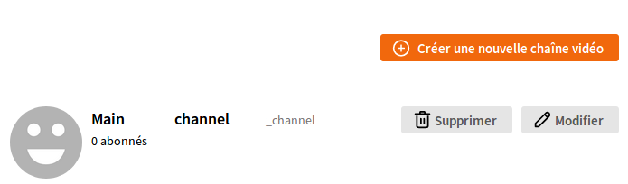
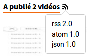

# Chaînes de vidéos

Vous l'avez peut-être remarqué : votre compte sur une instance Tube a la notion de "chaînes". Contrairement à YouTube où un compte correspond à une chaîne, sur Tube vous pouvez regrouper vos vidéos par thème ; ceux qui sont intéressés par les vidéos de votre chat pourront alors s'abonner à leur chaîne dédiée, alors que ceux qui sont intéressés par les vidéos de chiens ne verront pas les chats en s'abonnant à la chaîne où vous publiez vos vidéos.

## Voir et créer des chaînes

Vous pouvez bien sûr créer et supprimer des chaînes via le menu dédié dans vos paramètres, dans l'onglet `Ma bibliothèque` > `Mes chaînes`.

## Informer votre public lorsqu'une vidéo est publiée

Vos amis et votre public plus large peuvent voir et être informés des nouvelles vidéos sans avoir à vérifier régulièrement. Pour ce faire, ils peuvent "suivre" l'une de vos chaînes (ou l'ensemble de votre profil) :

* via leur compte Tube
* via leur compte Fediverse (en supposant qu'ils aient un compte sur une plateforme fédérée comme Mastodon ou Pleroma)
* via un format de syndication (en supposant qu'ils aient un agrégateur RSS ou Atom)

