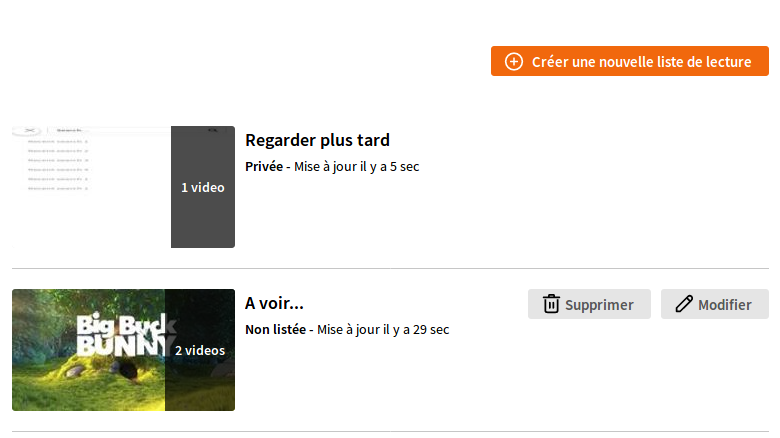
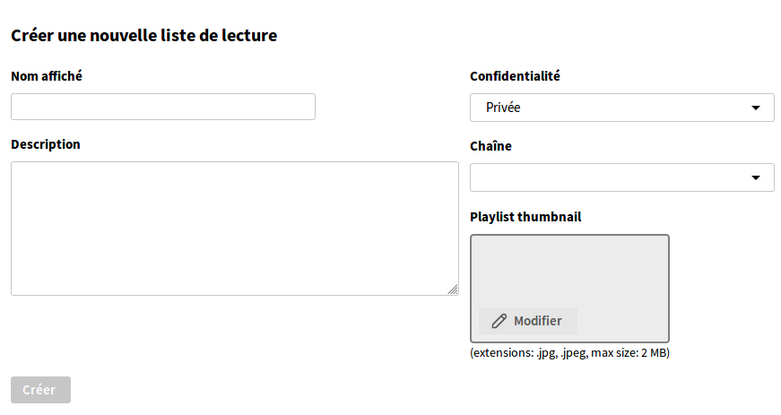
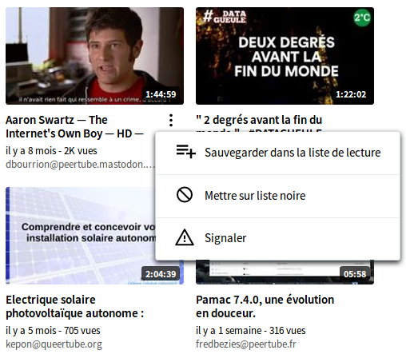
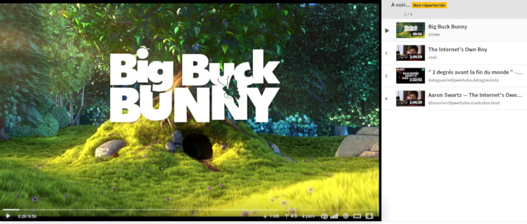

# Playlistes de vidéos

Tout comme sur les autres plates-formes vidéo, une playliste ou liste de lecture sur Tube est une collection ordonnée de vidéos qui peuvent être partagées ou gardées privées. Vous pouvez librement ajouter à une playliste vos propres vidéos ou celles d'autres personnes.

Vous avez déjà une playliste privée associée à votre compte : "A regarder plus tard" !

## Créer une playliste

La création de nouvelles playlistes peut se faire dans l'onglet `Ma bibliothèque` > `Mes listes de lecture` , ou directement via le menu de gauche. Cliquez ensuite sur "Créer une nouvelle liste de lecture".

Notez qu'une liste de lecture ne peut être associée à aucune chaîne vidéos, ou à n'importe quelle chaîne de votre choix. Cependant, lors de la création d'une liste de lecture publique, elle doit être associée à une chaîne.

Vous pouvez choisir une vignette pour la liste de lecture, ainsi qu'un titre et une description. Ils seront la première chose que les utilisateurs verront lorsqu'ils effectueront une recherche.

## Ajouter des vidéos aux playlistes

Les actions rapides qui apparaissent sur les miniatures en survol vous permettent d'ajouter rapidement des vidéos à vos listes de lecture.

## Ordonner une playliste

Les listes de lecture sont ordonnées de façon à ce que les téléspectateurs puissent regarder les vidéos de façon séquentielle. C'est à vous de commander les vidéos dans votre playliste une fois que vous les avez rassemblées. Cliquez sur le bouton "Modifier" dans la liste des listes de lecture pour accéder à une liste de commande par glisser-déposer.

## Visionner une playliste

L'affichage d'une liste de lecture déclenche un mode spécial du lecteur vidéo : les vidéos de la liste de lecture en cours sont répertoriées dans un volet à droite du lecteur, pour naviguer rapidement parmi elles et voir les vidéos à venir.

