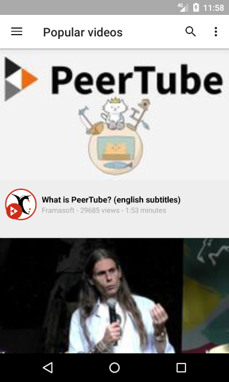
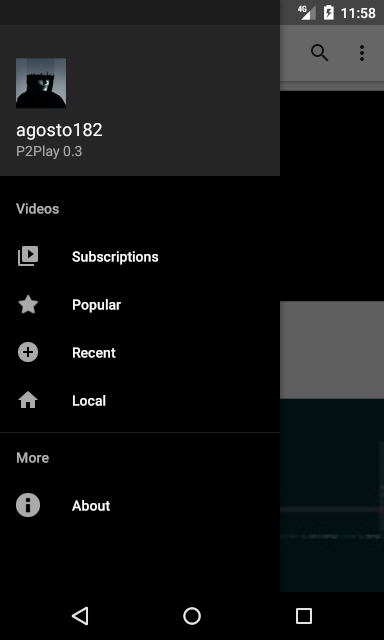
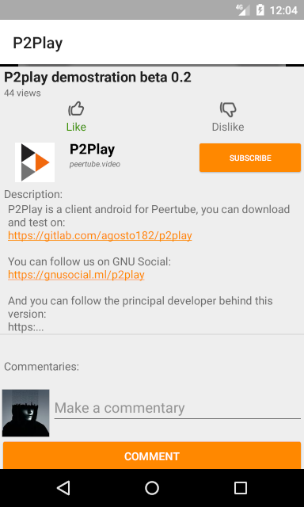
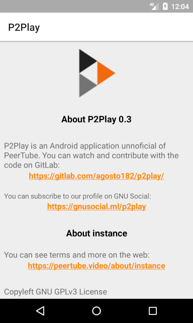
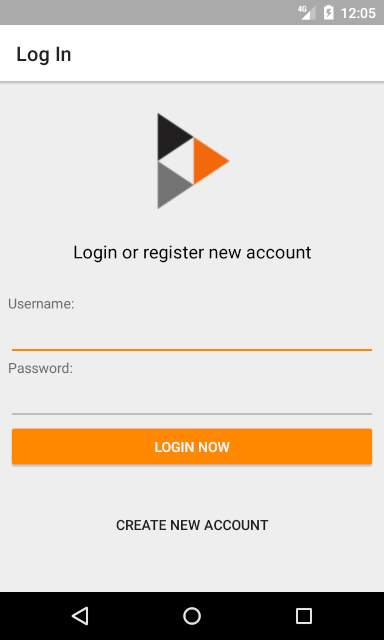
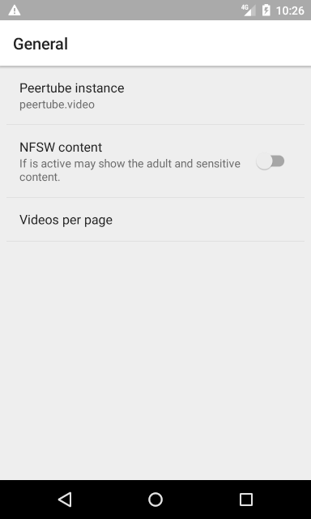

# P2Play
P2Play is an Android Application for Peertube.

[What is Peertube?](https://github.com/Chocobozzz/Tube/)

## Screenshots

## Documentation
Comming soon!

## Realeases (apk's)

[All realeases are here](https://gitlab.com/agosto182/p2play/tags)

## Features

- Show recent, popular and local list of videos.
- Reproduce videos
- Login and register in your instance
- Show uploaded videos
- Subscribe to accounts
- Show your subscripcion videos
- Show your history
- Rate videos
- Show and make commentaries
- Splash screen
- Search videos
- Infinite scroll
- Share videos
- Report videos
- Peertube profiles

## What to do? (in next version)

- Notifications
- Upload videos

## Demostrations

Demostration P2play Beta 0.2: https://peertube.video/videos/watch/730fa68e-32c4-4cdb-a7bb-1a819c9d3a46

Demostration P2Play Beta 0.1: https://peertube.video/videos/watch/2eb7b953-0b1b-4019-9300-817539f5f4e8

[Spanish] Demostracion P2Play Beta 0.1: https://peertube.video/videos/watch/d6a7da26-d3dd-43aa-ad5c-7d032603c848

## Contact
You can follow our accounts for get news and contact with the developers.

- WriteFreely (ActivityPub): https://personaljournal.ca/p2play/
- Peertube Channel: https://peertube.video/video-channels/90df4e5f-c834-4720-a5d7-c9faa0af0af5/videos

## About
P2Play is made in Android Studio with Kotlin code.

### Developers
- Ivan Agosto: [https://nerdica.net/profile/agosto182](https://gnusocial.ml/agosto182)

## License
This program is free software: you can redistribute it and/or modify it under the terms of the GNU Affero General Public License as published by the Free Software Foundation, either version 3 of the License, or (at your option) any later version.

This program is distributed in the hope that it will be useful, but WITHOUT ANY WARRANTY; without even the implied warranty of MERCHANTABILITY or FITNESS FOR A PARTICULAR PURPOSE. See the GNU Affero General Public License for more details.

You should have received a copy of the GNU Affero General Public License along with this program. If not, see [license](./LICENSE.md)
