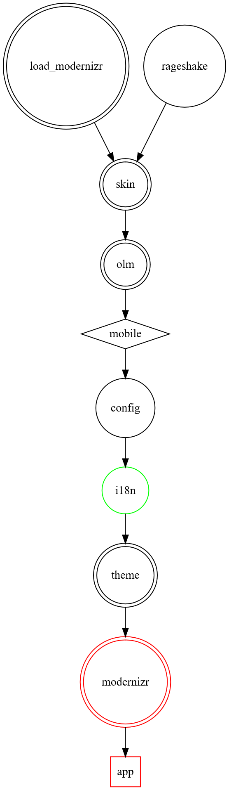
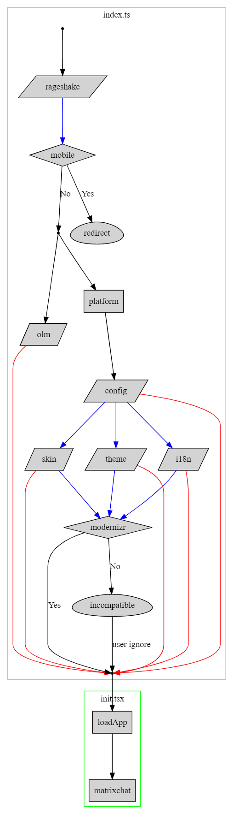
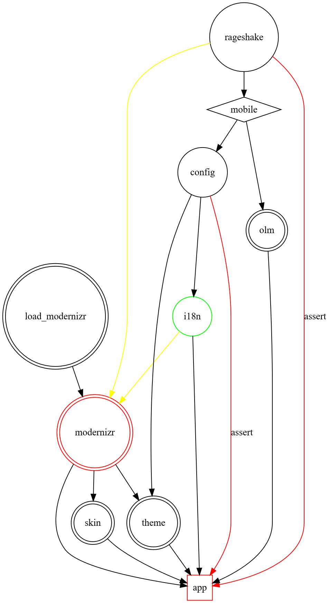

<!-- markdownlint-disable -->
# App load order

> Old slow flow:

  

> Current more parallel flow:

  

Code

<pre><code>
digraph G {
  node [shape=box];

  subgraph cluster_0 {
    color=orange;
    node [style=filled];
    label = "index.ts";

    entrypoint, s0, ready [shape=point];
    rageshake, config, i18n, theme, skin, olm [shape=parallelogram];
    mobile [shape=diamond, label="mobile"];
    modernizr [shape=diamond];
    redirect, incompatible [shape=egg];

    entrypoint -> rageshake;
    rageshake -> mobile [color=blue];
    mobile -> s0 [label="No"];
    mobile -> redirect [label="Yes"];

    s0 -> platform;
    s0 -> olm;
    platform -> config;

    config -> i18n [color=blue];
    config -> theme [color=blue];
    config -> skin [color=blue];

    i18n -> modernizr [color=blue];
    theme -> modernizr [color=blue];
    skin -> modernizr [color=blue];

    modernizr -> ready [label="Yes"];
    modernizr -> incompatible [label="No"];
    incompatible -> ready [label="user ignore"];

    olm -> ready [color=red];
    config -> ready [color=red];
    skin -> ready [color=red];
    theme -> ready [color=red];
    i18n -> ready [color=red];
  }

  subgraph cluster_1 {
    color = green;
    node [style=filled];
    label = "init.tsx";

    ready -> loadApp;
    loadApp -> matrixchat;
  }
}
</code></pre>

Key:
+ Parallelogram: async/await task
+ Box: sync task
+ Diamond: conditional branch
+ Egg: user interaction
+ Blue arrow: async task is allowed to settle but allowed to fail
+ Red arrow: async task success is asserted

Notes:
+ A task begins when all its dependencies (arrows going into it) are fulfilled.
+ The success of setting up rageshake is never asserted, element-web has a fallback path for running without IDB (and thus rageshake).
+ Everything is awaited to be settled before the Modernizr check, to allow it to make use of things like i18n if they are successful.

  

